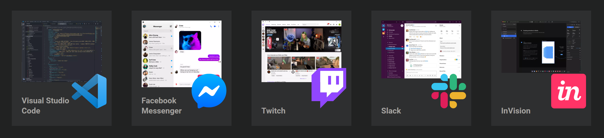
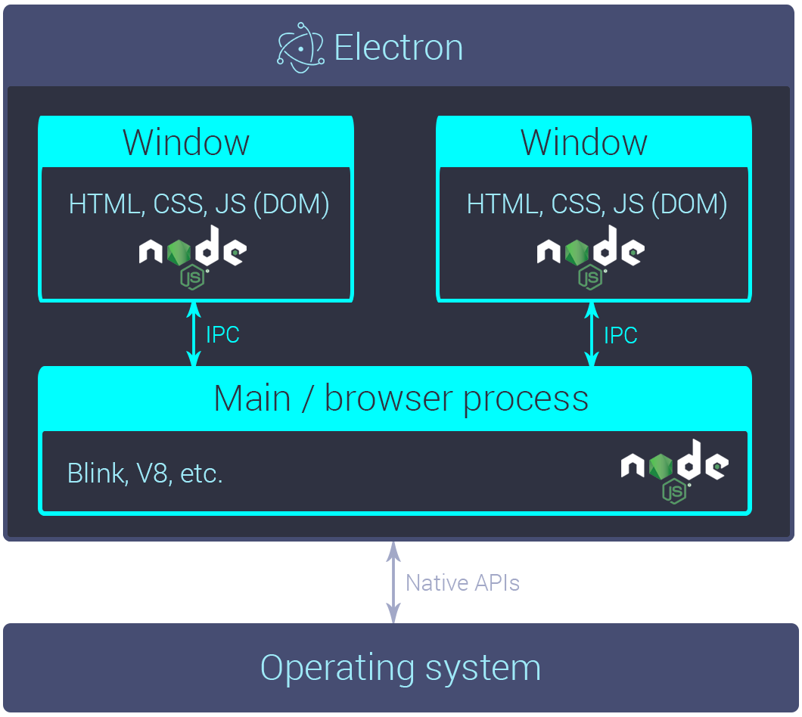
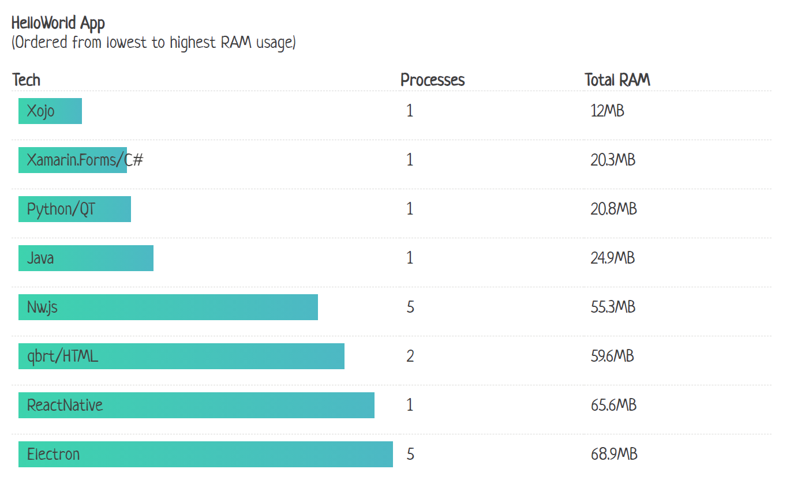

[//]: # (TODO: nicht zu sehr wie ein tutorial, eher kritische analyse)
[//]: # (TODO: test example code)

# Electron

Simon Jäger, BWD0920

NOTE: Begrüssung, Vorstellung, Einleitung Thema
(Fokus technisch, DX, vergleich zu Konkurrenz, Anwendungsgebiet)

--------------------------------------------------------------------------------

<!-- .slide: data-background-color="#2B2E3B" data-background-image="./images/electron.png" data-background-size="contain" -->

<small>Abb. 1: Electron-Logo und Slogan (OpenJS Foundation, o. J.)</small>

---



<small>Abb. 2: Bekannte Electron-Apps (OpenJS Foundation, o. J.)</small>

NOTE: grosse firmen wie microsoft setzen auf electron. grosse community, ausführliche docs, ...

---



<small>Abb. 3: Electron-Architektur (Lynch, 2017)</small>

---

```ts
// main.ts
import {app, BrowserWindow} from "electron"

app.whenReady().then(async () => {
  const win = new BrowserWindow()
  await win.loadFile("index.html")
})
```

```html
<!-- index.html-->
<h1>App UI</h1>
<button onclick="saveFile()">Call a native API</button>
```

---

```ts
// native-api.ts
import os from "os"
import fs from "fs"

async saveFile() {
  await fs.writeFile(
    os.homedir() + 'foobar.txt',
    'Lorem ipsum dolor sit amet'
  )
}
```

---

Toast-Notification (C#, UWP)

```csharp
using Windows.UI.Notifications;
using Microsoft.Toolkit.Uwp.Notifications;

var content = new ToastContentBuilder()
  .AddText("Title")
  .AddText("Body text")
  .GetToastContent();
var toast = new ToastNotification(content.GetXml());
ToastNotificationManager.CreateToastNotifier().Show(toast);
```

---

Toast-Notification (TS, Electron)

```ts
import {Notification} from "electron"

const toast = new Notification({
  title: 'Title',
  body: 'Body text'
})
toast.show()
```

---

> „Do the simplest thing that could possibly work.“ (Succi et al. 2001)

---

Packaging

```sh
electron-forge make
# that's it!
```

---



<small>Abb. 4: RAM-Verbrauch verschiedener Platformen (O'Kelly, 2017)</small>

NOTE: ähnlich auch in anderen kriterien wie programmgrösse etc.
geeignet für datenverarbeitungs und office-apps (weder mini-apps wie color-picker noch aaa-games, cad, ...)

---

# Demo und Fazit

NOTE: magius zeigen, fazit ziehen, links zu slides/magius senden und abschliessen

--------------------------------------------------------------------------------

###### Abbildungsverzeichnis

<a href="#/1/0" class="source">
Abb. 1: Electron-Logo und Slogan (OpenJS Foundation, o. J.)
</a>

<a href="#/1/1" class="source">
Abb. 2: Bekannte Electron-Apps (OpenJS Foundation, o. J.)
</a>

<a href="#/1/2" class="source">
Abb. 3: Electron-Architektur (Lynch, 2017)
</a>

<a href="#/1/9" class="source">
Abb. 4: RAM-Verbrauch verschiedener Platformen (O'Kelly, 2017)
</a>

--------------------------------------------------------------------------------

###### Quellenverzeichnis

<div class="source">
Lynch, A., 2017. <i>Beyond The Browser: From Web Apps To Desktop Apps</i>, [online]
https://www.smashingmagazine.com/2017/03/beyond-browser-web-desktop-apps/ [03.11.2020]
</div>

<div class="source">
O’Kelly, R., 2017. <i>Electron memory usage compared to other cross-platform frameworks</i>, [online]
http://roryok.com/blog/2017/08/electron-memory-usage-compared-to-other-cross-platform-frameworks/ [10.11.2020]
</div>

<div class="source">
OpenJS Foundation, o. J.. <i>Electron | Build cross-platform desktop apps with JavaScript, HTML, and CSS</i>, [online]
https://www.electronjs.org/ [03.11.2020]
</div>

<div class="source">
Succi, G., Marchesi, M., 2001. <i>Extreme Programming Examined</i>, 1. Aufl., Boston: Addison-Wesley.
</div>
